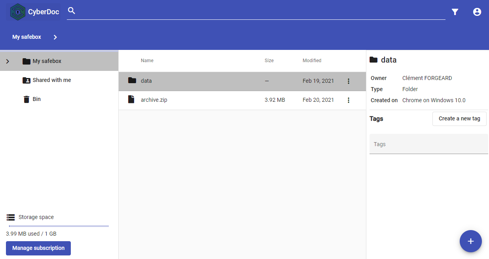

<p align="center">
 
</p>

CyberDoc
========


CyberDoc is an open source cloud file storage server (similar to Google Drive) with built-in encryption.

> **[Demo (YouTube video)](https://www.youtube.com/watch?v=sZweBaCeu-k)**



[Server architecture](https://github.com/fjourdren/CyberDoc/blob/master/arch.png)
## Features

- ✅ Encrypted file storage (upload / download / manage)
- ✅ Search by name / last modification / type / tags
- ✅ Share files
- ✅ Collaborative edition of text documents
- ✅ Subscription system
- ✅ 2FA support
- ✅ Light/Dark theme
- ✅ Mobile support

## Test CyberDoc on your computer !

> ***Features that uses external services are not available in this demo** : 2FA, Email sending, Subscription system, Collaborative edition of text documents*

>**This is a demo that is only accessible with `localhost` for security reasons. 
> To be used for demo purposes only.**

After installing `Docker Compose`, please open a shell in the `CyberDoc` folder and run this command : `docker-compose up`. 

*If you got this error `ERROR: Couldn't connect to Docker daemon at http+docker://localhost - is it running?`, try this command instead : `sudo docker-compose up`.*

After waiting 15-30 minutes (depending of your computer and Internet connection), you will see a console output similar to this one :

````
frontend    | chunk {main} main.js, main.js.map (main) 1.17 MB [initial] [rendered]
frontend    | chunk {polyfills} polyfills.js, polyfills.js.map (polyfills) 870 kB [initial] [rendered]
frontend    | chunk {runtime} runtime.js, runtime.js.map (runtime) 6.15 kB [entry] [rendered]
frontend    | chunk {styles} styles.js, styles.js.map (styles) 208 kB [initial] [rendered]
frontend    | chunk {vendor} vendor.js, vendor.js.map (vendor) 6.11 MB [initial] [rendered]
frontend    | Date: 2021-02-22T20:02:09.172Z - Hash: 5c543685b4f57969525d - Time: 96404ms
frontend    | ** Angular Live Development Server is listening on 0.0.0.0:4200, open your browser on http://localhost:4200/ **
frontend    | : Compiled successfully.
frontend    |
frontend    | Date: 2021-02-22T20:02:32.221Z - Hash: 5c543685b4f57969525d
frontend    | 5 unchanged chunks
frontend    |
frontend    | Time: 20605ms
frontend    | : Compiled successfully.
````

You can now use CyberDoc by opening a browser with this address : http://localhost:4200


## Contributors

<table>
  <tr>
    <td align="center"><a href="https://github.com/ndelvoye"><br /><sub><b>DELVOYE Nicolhas</b></sub></a></td>
    <td align="center"><a href="https://github.com/cforgeard"><br /><sub><b>FORGEARD Clément</b></sub></a></td>
    <td align="center"><a href="https://github.com/fjourdren"><br /><sub><b>JOURDREN Flavien</b></sub></a></td>
    <td align="center"><a href="https://github.com/galeadon"><br /><sub><b>LE GAL Alexis</b></sub></a></td>
    <td align="center"><a href="https://maeg.fr/index"><br /><sub><b>MORIN--COZANNET Maeg</b></sub></a></td>
  </tr>
</table>
